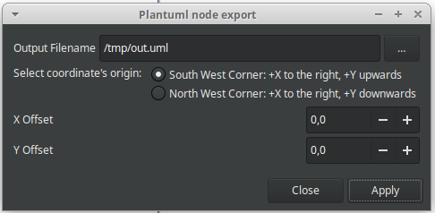
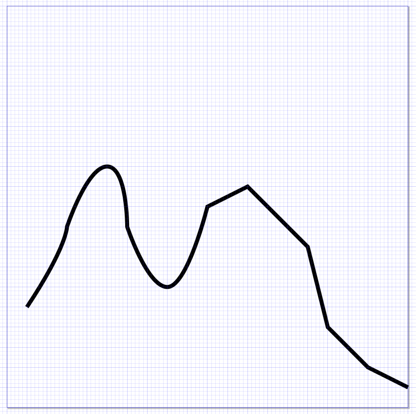
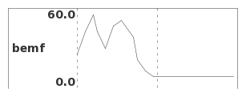
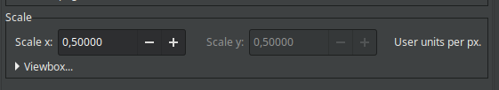

# Inkscape Extension to exprt all nodes of a given path to a plantuml-compatible file.

Simple Inkscape extension to convert nodes of paths to x,y coordinates which can be used in plantuml files as
"analog" signals

Features:
- X, Y offsets
- Configurable origin
- Output file



Insipration came from
- tekolay's [csv_output](https://github.com/tbekolay/csv_output)
- jwcliff's [Inkscape_Exportxy](https://github.com/jwcliff/Inkscape_Exportxy)
- camrbuss's [nodes_to_csv](https://github.com/camrbuss/nodes_to_csv)

## Usage

1. Set your document size so that the width and height (in user units) match the steps/resolution you want to export to
   plantuml. E.g. if you want your exported analog signal to be 100 plantuml time units wide, make sure the path in inkscape
   is 100 inkscape user units wide.
2. For ease of use, set up a grid (Document Properties -> Grids) with 1 unit wide
3. Draw the desired shape using the bezier curve tool, optionally using the grid to put your nodes.
   No 2 nodes are allowed to have the same X coordinate, that's why the grid can be useful
3. Select the path to export
5. Export (Extensions > Export > Plantuml node export...)


## Example

The following shape was drawn in a 100px by 100px document.



An export of this shape yields the following file:

```
@+5.0
out is 25.0
@+10.0
out is 45.0
@+10.0
out is 60.0
@+5.0
out is 45.0
@+10.0
out is 30.0
@+10.0
out is 50.0
@+10.0
out is 55.0
@+15.0
out is 40.0
@+5.0
out is 20.0
@+10.0
out is 10.0
@+10.0
out is 5.0
```

And rendered using plantuml:



## Installation

1. Copy `plantuml_node_export.inx` and `plantuml_node_export.py` to your Inkscape extensions folder. On Linux it is located at `~/.config/inkscape/extensions/`
2. Relaunch Inkscape

## Potential issues

1. The extension exports the coordinates in "User units", which could correspond to pixels, millimeters or elephants.
   If you've been playing around with the display and size unit in the document properties window, it's possible that
   the scale (ratio of user units to display units) setting is not 100%, which could unexpected values in the output.
   The "scale" setting looks as follows:

   

2. I've had issues installing this on inkscape versions > 1.1 on Linux. If you run into issues that might be related to
   the extension system in inkscape itself, it might be worth trying to downgrade first.

